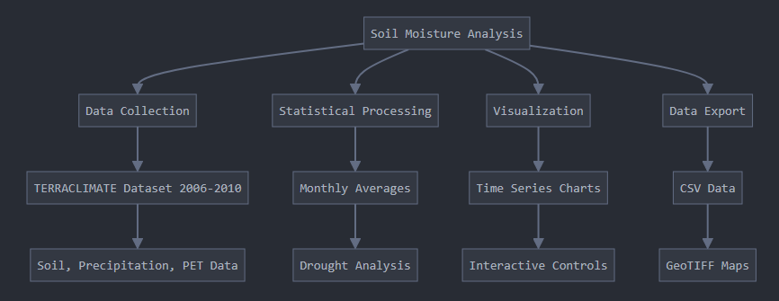
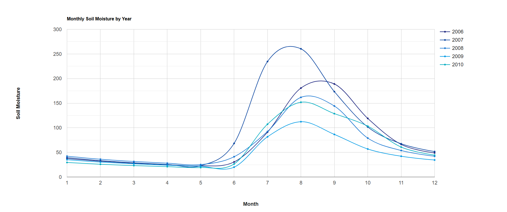
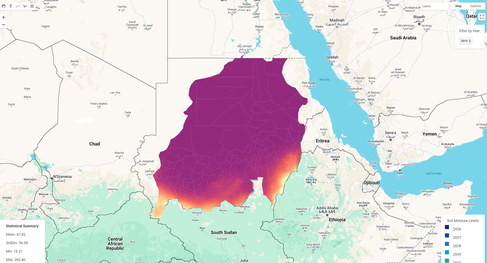
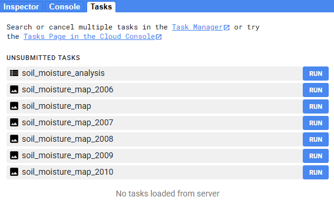

# Soil-Moisture-Analysis-Project
Advanced Earth Engine script for analyzing soil moisture patterns using TERRACLIMATE data (2006-2010).

## Features

- Monthly soil moisture analysis
- Drought detection system
- Interactive visualization
- Statistical summaries
- Multi-band correlation analysis
- Data export capabilities

## Data Sources
- Dataset: IDAHO_EPSCOR/TERRACLIMATE
- Parameters: Soil Moisture, Precipitation, PET
- Resolution: 11km
- Temporal Range: 2006-2010

## Methodology

# Outputs
* Time series charts
* Statistical summaries
* Drought alerts
* CSV data exports
* GeoTIFF maps

# Installation

* Clone repository
* Upload script to Google Earth Engine
* Define study area ('table' asset)
* Run analysis

# Requirements

* Google Earth Engine account
* Study area geometry ('table' asset)

# License
* MIT
